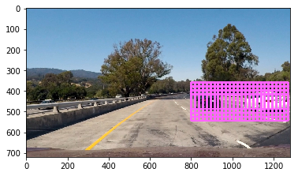

# Synopsis

This project is submitted as a report for the Udacity self driving nano Degree program. 

Term 1- Project 5: Vehicle Detection.

# Read Training-Test images

The training and test images are read using the glob function,  

`````

noncarsfiles = glob.glob('training_data/non-vehicles/non-vehicles/**/*.png')
carfiles = glob.glob('training_data/vehicles/vehicles/**/*.png')

noncars = []
cars = []
for noncar in noncarsfiles:

    noncars.append(noncar)
    
for car in carfiles:

    cars.append(car)
    

print ("total number non cars:", len(noncars))


print ("total number cars:", len(cars))

`````


# Feature extraction

Extraction of HOG features are done by using the Scikit library

````
from skimage.feature import hog
````

The HOG feature extraction is done in the follwoing part,  


``````

def find_hog_features(image, orientation, pixels, cells, verbose, f_vector=True):

    if verbose == True: 
        features, hog_image = hog(image, orientations=orientation, 
                                  pixels_per_cell=(pixels, pixels),
                                  cells_per_block=(cells, cells), 
                                  transform_sqrt=True, 
                                  visualise=verbose, feature_vector=f_vector)
        return features, hog_image
    else:      
        features = hog(image, orientations=orientation, 
                       pixels_per_cell=(pixels, pixels),
                       cells_per_block=(cells, cells), 
                       transform_sqrt=True, 
                       visualise=False, feature_vector=f_vector)
        return features
        
``````

where the following parmeters where used,  

````
pixels = 8 
cells = 2 
orientation = 12 
bin_size = (32,32)
nbins = 32 
verbose=False 
color_channel=1
color_space = ['LUV', 'HSV', 'HLS', 'YCR_CB', 'RGB', 'YUV']
print("All variables defined")

````

All the features from both the cars and non-cars images are done in the following section.  

### Hog features

Histogram of orientation Gradient extracted for each channel in the image.  

`````
def find_hog_features(image, orientation, pixels, cells, verbose, f_vector=True):

    if verbose == True: 
    
        features, hog_image = hog(image, orientations=orientation, 
                                  pixels_per_cell=(pixels, pixels),
                                  cells_per_block=(cells, cells), 
                                  transform_sqrt=True, 
                                  visualise=verbose, feature_vector=f_vector)
        return features, hog_image
    else:      
    
        features = hog(image, orientations=orientation, 
                       pixels_per_cell=(pixels, pixels),
                       cells_per_block=(cells, cells), 
                       transform_sqrt=True, 
                       visualise=False, feature_vector=f_vector)
        return features

`````

`````
feature_image_1 = feature_image[:,:,0]
feature_image_2 = feature_image[:,:,1]
feature_image_3 = feature_image[:,:,2]
    
hog_feature_1=find_hog_features(feature_image_1, orientation, pixels, cells, verbose, f_vector=True)
hog_feature_2=find_hog_features(feature_image_2, orientation, pixels, cells, verbose, f_vector=True)
hog_feature_3=find_hog_features(feature_image_3, orientation, pixels, cells, verbose, f_vector=True)
    
hog_feature = np.hstack((hog_feature_1, hog_feature_2, hog_feature_3))

`````
### Color histograms 

The color Histogram is extracted as follows,  

``````
def color_histogram(image, nbins):

    channel_r = np.histogram(image[:,:,0], bins=nbins, range=(0, 256))[0] 
    channel_g = np.histogram(image[:,:,1], bins=nbins, range=(0, 256))[0]
    channel_b = np.histogram(image[:,:,2], bins=nbins, range=(0, 256))[0]
    hist = np.hstack((channel_r, channel_g, channel_b))
    return hist
``````

### Bin color features

Bin color features are extracted as follows,  

``````
def binned_color_feature(image, bin_size): 

    color_r = cv2.resize(image[:,:,0], bin_size).ravel()
    color_g = cv2.resize(image[:,:,1], bin_size).ravel()
    color_b = cv2.resize(image[:,:,2], bin_size).ravel()
    return np.hstack((color_r, color_g, color_b))
``````


For the training and classification purposes, the HOG, color Histogram and bin color features form the images are used.   


```````
def find_image_feature(feature_image, orientation, pixels, cells, nbins, bin_size, verbose, color_space):
    
    features =[]
    hog_feature = []
   
    # Feature 1
    color_hist_feature = color_histogram(feature_image, nbins)

    # Feature 2
    bin_color_feature = binned_color_feature(feature_image, bin_size)
   

    # Feature 3    
    feature_image_1 = feature_image[:,:,0]
    feature_image_2 = feature_image[:,:,1]
    feature_image_3 = feature_image[:,:,2]
    
    hog_feature_1=find_hog_features(feature_image_1, orientation, pixels, cells, verbose, f_vector=True)
    hog_feature_2=find_hog_features(feature_image_2, orientation, pixels, cells, verbose, f_vector=True)
    hog_feature_3=find_hog_features(feature_image_3, orientation, pixels, cells, verbose, f_vector=True)
    
    hog_feature = np.hstack((hog_feature_1, 
                             hog_feature_2,
                             hog_feature_3))
    
    #hog_feature.append(feature)
        
    features.append(color_hist_feature)
    features.append(bin_color_feature)
    features.append(hog_feature)
        
    return features 
    
    
```````


# Color spaces  


Various color spaces are used to train the classifier such as LSV, HSV, HLS, RGB, YUV and YCR_CB.  

``````

        if color_space == 'LUV':
            feature_image = cv2.cvtColor(image, cv2.COLOR_RGB2LUV)
        elif color_space == 'HSV':
            feature_image = cv2.cvtColor(image, cv2.COLOR_RGB2HSV)
        elif color_space == 'HLS':
            feature_image = cv2.cvtColor(image, cv2.COLOR_RGB2HLS)
        elif color_space == 'YCR_CB':
            feature_image = cv2.cvtColor(image, cv2.COLOR_RGB2YCR_CB)
        elif color_space == 'YUV':
            feature_image = cv2.cvtColor(image, cv2.COLOR_RGB2YUV)
            
``````

# Classifier


Support Vector Machine(SVM), decission trees, stochastic gradient descent classifier(SGD), Orthogonal Matching Pursuit model(OMP) are trained and the accuracies are compared.   

The decission trees are way too slower than svm as well as the accuracy is also lower.  

The SGD has in general higher accuracy and is also faster than SGD. The accuracy of OMP is also comparitively lower than SGD or SVM classifiers.  

**References:**  
[ Orthogonal Matching Pursuit-OMP](http://scikit-learn.org/stable/modules/generated/sklearn.linear_model.OrthogonalMatchingPursuit.html)  
[stochastic gradient descent classifier-SGD](http://scikit-learn.org/stable/modules/sgd.html)  
[Decision trees](http://scikit-learn.org/stable/modules/tree.html)  
[Support Vector Machine-SVM](http://scikit-learn.org/stable/modules/svm.html)   

`````
sklearn.svm import LinearSVC  
sklearn import tree  
sklearn import linear_model  
sklearn.linear_model import OrthogonalMatchingPursuit  
sklearn.linear_model import OrthogonalMatchingPursuitCV  

`````


The classifier is trained and accuracy is tested in the following section,


It is observed that the all the classifier faired close to each other and the accuracies are as follows,  

### SVM

````
Test Accuracy of SVC in LUV  is   =  0.983117613956  in  40.136717081069946  seconds
Test Accuracy of SVC in HSV  is   =  0.983117613956  in  35.43988490104675  seconds
Test Accuracy of SVC in HLS  is   =  0.981992121553  in  34.38728380203247  seconds
Test Accuracy of SVC in YCR_CB  is   =  0.980303882949  in  33.973474740982056  seconds
Test Accuracy of SVC in RGB  is   =  0.976083286438  in  33.38496804237366  seconds
Test Accuracy of SVC in YUV  is   =  0.980022509848  in  36.07208728790283  seconds

````

### Decission tree

````
Test Accuracy of d_tree in LUV  is   =  0.905740011255  in  377.10723662376404  seconds
Test Accuracy of d_tree in HSV  is   =  0.907428249859  in  291.5932502746582  seconds
Test Accuracy of d_tree in HLS  is   =  0.906865503658  in  351.1618928909302  seconds
Test Accuracy of d_tree in YCR_CB  is   =  0.903207653348  in  366.9865119457245  seconds
Test Accuracy of d_tree in RGB  is   =  0.910804727068  in  318.3489656448364  seconds
Test Accuracy of d_tree in YUV  is   =  0.920371412493  in  337.1887891292572  seconds

````

### SGD

````
Test Accuracy of sgd in LUV  is   =  0.976646032639  in  1.3133013248443604  seconds
Test Accuracy of sgd in HSV  is   =  0.971862689927  in  1.3413865566253662  seconds
Test Accuracy of sgd in HLS  is   =  0.975801913337  in  1.2988853454589844  seconds
Test Accuracy of sgd in YCR_CB  is   =  0.968204839617  in  1.300750970840454  seconds
Test Accuracy of sgd in RGB  is   =  0.976083286438  in  1.2937016487121582  seconds
Test Accuracy of sgd in YUV  is   =  0.970174451322  in  1.3382856845855713  seconds

````
  
###  OMP

````
Test Accuracy of omp in LUV  is   =  0.819591049262  in  206.8114879131317  seconds
Test Accuracy of omp in HSV  is   =  0.821782165565  in  209.38108229637146  seconds
Test Accuracy of omp in HLS  is   =  0.829779298271  in  206.27019953727722  seconds
Test Accuracy of omp in YCR_CB  is   =  0.820469965268  in  223.94852423667908  seconds
Test Accuracy of omp in RGB  is   =  0.822866082506  in  218.14390516281128  seconds
Test Accuracy of omp in YUV  is   =  0.827968576692  in  211.00104022026062  seconds

````

# Sliding window  


A window of a (X, Y) size is slid through the image to find a match to the feature that is used in the training,  


`````

def slide_window(img, window, overlap, x_coord, y_coord):

    if x_coord[0] == None:
        x_coord[0] = 0
    if x_coord[1] == None:
        x_coord[1] = img.shape[1]
    if y_coord[0] == None:
        y_coord[0] = 0
    if y_coord[1] == None:
        y_coord[1] = img.shape[0]
       
    xspan = x_coord[1] - x_coord[0]
    yspan = y_coord[1] - y_coord[0]
    
    step_x = np.int(window[0]*(1 - overlap[0]))
    step_y = np.int(window[1]*(1 - overlap[1]))
    
    nx_buffer = np.int(window[0]*(overlap[0]))
    ny_buffer = np.int(window[1]*(overlap[1]))
    nx_windows = np.int((xspan-nx_buffer)/step_x) 
    ny_windows = np.int((yspan-ny_buffer)/step_y) 

    window_list = []

    for ys in range(ny_windows):
        for xs in range(nx_windows):
            # Calculate window position
            startx = xs*step_x + x_coord[0]
            endx = startx + window[0]
            starty = ys*step_y + y_coord[0]
            endy = starty + window[1]
            
            window_list.append(((startx, starty), (endx, endy)))
    
    return window_list

`````

An over lap for the sliding windows of 85% is used.  

The training images were of sizes 64x64. If a very smaller scale (smaller than 64x64) is used then, scalling up to 64x64 will increase the loss of spatial informations. Thus the scale of window is kept as low as 100% of training sizes, 48x48 and 2.5 times bigger, 160X160.  

Various sizes of sliding windows are used for various seections on the image, Few images are as follows,  




It is observed that the SVM seems to the best classifier. Thus SVM classifier is used for the classification purpose in this project.  


# Pipeline and Bounding boxes

Using the sliding window gives the all the windows that are classified as cars. Thus multiple windows representing a single object is combined into one single object by generating a Heatmap.  

To filter out the false positive the history of the objects are used. The _deque_ option is used for this purpose.  

````
from collections import deque
````

The pipeline to classify the cars are as follows,  

````
first_time = True
b_box_previous_frame = deque(maxlen=remember)
def pipeline(image):   
    
    bounding_boxes =[]
    test_images = []
    overlap =0.85
   
   
    heat_threshold = 20 

    windows_1_2 = slide_window(image, x_coord=[800, None], y_coord=[360, 550], 
                               window=(128, 128), overlap=(overlap, overlap))  

    windows_2_2 = slide_window(image, x_coord=[100, 400], y_coord=[360, 500], 
                               window=(128, 128), overlap=(overlap, overlap))

    windows_3_1 = slide_window(image, x_coord=[750, None], y_coord=[400, 470], 
                             window=(64, 64), overlap=(overlap, overlap))

    b_box =[]

    b_box += (find_cars(image, windows_1_2, index))
    b_box += (find_cars(image, windows_2_2, index))
    b_box += (find_cars(image, windows_3_1, index))
    
    
    global first_time, b_box_previous_frame
    
    if first_time:
        b_box_previous_frame.extend(b_box)        
        
        first_time=False
    
    heatmap_previous=np.zeros_like(image[:,:,0]).astype(np.float)
    heat_map_previous=find_heatmap(heatmap_previous, b_box_previous_frame)
    
    heatmap = np.zeros_like(image[:,:,0]).astype(np.float)
    heat_map=find_heatmap(heatmap, b_box)
    
    heatmap_sum = np.add(heat_map_previous,heat_map)
    heat = threshold(heatmap_sum,heat_threshold)

    heat_clip = np.clip(heat, 0 ,255)

    labels = label(heat_clip)
    car_box = draw_cars(image, labels)
        
    b_box_previous_frame.extend(b_box)
        
    return car_box
````


# Output

For training and classification the YUV color space is used. 

The output is saved and submitted as project_video_output.mp4


# Shortcomings

Some section in the images are often falsely classified as cars such as the central dividers and metal guidelanes on the sides of the roads. This could have araised because the image features of these sections were looking similar to that of a car in certain view/angles.

Using more training data(cars as well as non-cars) under various lightning conditions and from various position and angles could improve the accuracy.

On few frames the black car was not correctly classified, thus few images of the black car is used in the training upon suggestions.

### hard positive mining

Upon suggestion, few images of the black car is also used for the training purposes, the images that were used in the trainings are as follows,  


